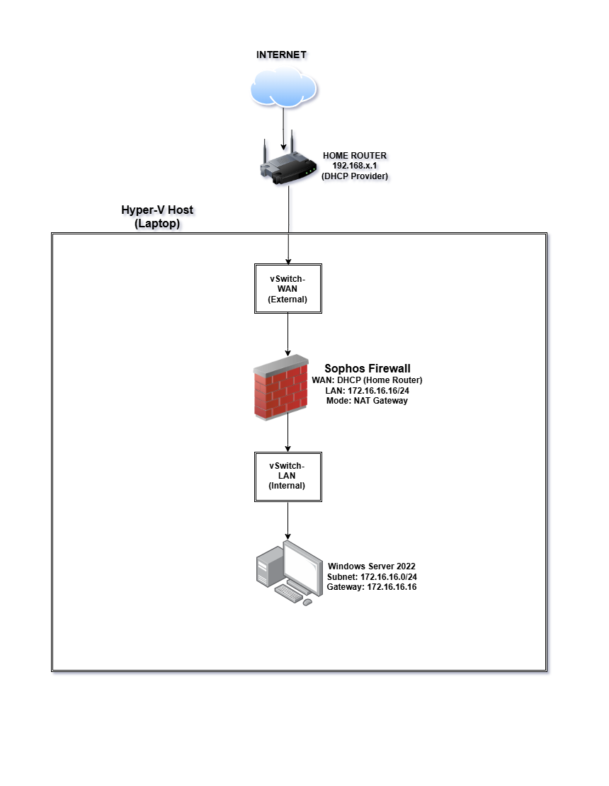
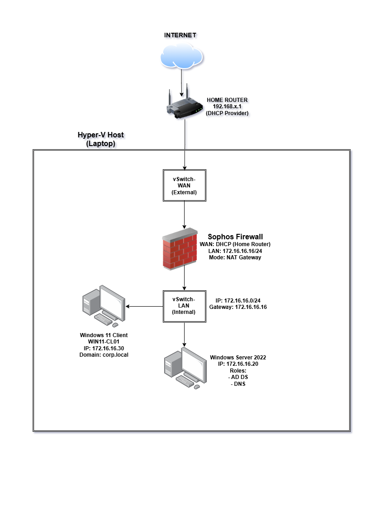

# 🛡 Enterprise Cybersecurity Home Lab (Hyper-V + Sophos)

## 📌 Project Summary

This project demonstrates the design, deployment, and troubleshooting of a virtual enterprise network security environment using Hyper-V and Sophos Firewall Home Edition.

The objective is to simulate a real-world corporate infrastructure for hands-on cybersecurity practice including network segmentation, firewall configuration, Active Directory integration, and attack detection.

This lab mirrors small-to-mid enterprise network architecture.

**Infrastructure Overview**

**Hypervisor:** Microsoft Hyper-V  
**Firewall:** Sophos Firewall Home Edition  
**Server OS:** Windows Server 2022 (Planned AD Deployment)  
**Network Model:** Segmented WAN / LAN architecture  

**Core Components**

- External Virtual Switch (WAN)
- Internal Virtual Switch (LAN)
- Sophos Firewall (Dual-homed)
- Internal Windows Server
- Future Domain-Joined Client Machines

---
## 📊 Network Diagram

**🔥 Firewall Deployment Details**

**Virtual Machine Configuration**

- Generation 1 (BIOS-based firmware)
- 4GB Static RAM (Dynamic memory disabled)
- 60GB Virtual Disk
- Dual Network Adapters:
  - Adapter 1 → vSwitch-LAN
  - Adapter 2 → vSwitch-WAN

**LAN Configuration**

- LAN IP: 172.16.16.16/24
- DHCP enabled for lab clients
- NAT routing enabled
- Secure Web Admin Access via HTTPS (Port 4444)

**Troubleshooting Performed**

This lab required diagnosing and resolving multiple deployment issues.

**PXE Boot Failure**
Issue:  
“The boot loader did not load an operating system.”

Root Cause:  
UEFI firmware incompatibility with Sophos image.

Resolution:  
Recreated VM using Generation 1 BIOS-based firmware.

---

**firstboot failed: swapon /dev/swap**

Root Cause:  
Dynamic memory instability and insufficient static allocation.

Resolution:  
Disabled Dynamic Memory and allocated fixed 4096MB RAM.

---

**No Web Interface Access**

Root Cause:  
Incorrect WAN/LAN interface mapping in Hyper-V.

Resolution:  
Corrected adapter assignments:
- LAN → Internal Switch
- WAN → External Switch

Successfully restored management access.

---

**Technical Skills Demonstrated**

- Virtualization deployment (Hyper-V)
- Network segmentation (Layer 3 design)
- Dual-homed firewall architecture
- NAT and gateway configuration
- Firewall web management configuration
- DHCP scope configuration
- Secure lab isolation principles

---

**Upcoming Enhancements**

- Deploy Windows Server 2022 Domain Controller
- Configure Active Directory & DNS
- Join Windows Client to domain
- Implement AD-based firewall policies
- Simulate attacker VM for detection testing
- Monitor traffic & security logs

---
**Phase 2 – Active Directory Integration DNS & Group Policy Deployment**

In Phase 2, the lab environment was extended to include:
 - Deployment of Windows Server 2022 (Desktop Experience) as Domain Controller
 - Installation and configuration of:
    i. Active Directory Domain Services (AD DS)
   ii. DNS Server Role
 - Creation of domain: corp.local
 - Creation of domain user: labuser
 - Deployment of Windows 11 client machine
 - Successful domain join and authentication validation
📊 Updated Network Diagram

**Group Policy Deployment**
A centralized baseline security policy was created and linked to the domain.
GPO Created: CORP Baseline Security Policy

**Configurations Applied:**
i. Account Lockout Policy
 - 5 failed attempts
 - 15-minute lockout duration
ii. User Restrictions
 - Disabled access to Control Panel
iii. Removable Storage Control
 - Denied access to USB storage devices

Policies were applied via: Computer Configuration → Policies → Security Settings
Validation performed using: gpupdate /force and gpresult /r

**Challenge: Domain User Unable to Log In**

While validating domain authentication on the Windows client machine, the following error occurred:
**“To sign in remotely you need the right to sign in through Remote Desktop Services.”**

**Root Cause**
A misconfiguration in User Rights Assignment within Group Policy modified default logon permissions.
This unintentionally restricted domain user authentication.

Specifically:
- Required security principals were not properly included
- Logon rights precedence in GPO overrode expected behavior
I found out that this is a common enterprise misconfiguration scenario when adjusting RDP or logon security policies.

**Resolution**
 - Reviewed Group Policy → User Rights Assignment
 - Verified membership of required security groups
 - Ensured correct assignment under: Allow log on through Remote Desktop Services
 - Forced policy update: gpupdate /force
 - Successfully validated domain login post-restart
   
**Advanced Group Policy Hardening**
Additional hardening controls were implemented

i. Password Policy Hardening
Configured via: Computer Configuration → Policies → Windows Settings → Security Settings → Account Policies
Changes applied:
 - Minimum password length: 12 characters
 - Complexity requirements: Enabled
 - Maximum password age: 60 days
 - Account lockout threshold: 5 failed attempts
 - Lockout duration: 15 minutes
   
ii. Endpoint Hardening 
 - Disabled access to Control Panel
 - Prevented access to Command Prompt
 - Disabled Windows Defender Antivirus turnoff
 - Enforced Windows Defender Firewall (Domain Profile enabled, inbound blocked)
   
🧠 Skills Demonstrated
 - Active Directory deployment
 - DNS configuration and validation
 - Domain join troubleshooting
 - Group Policy creation and linking
 - User Rights Assignment management
 - Enterprise authentication troubleshooting
 - Policy validation using gpresult

 

