# 🛡 Enterprise Cybersecurity Home Lab (Hyper-V + Sophos)

## 📌 Project Summary

This project demonstrates the design, deployment, and troubleshooting of a virtual enterprise network security environment using Hyper-V and Sophos Firewall Home Edition.

The objective is to simulate a real-world corporate infrastructure for hands-on cybersecurity practice including network segmentation, firewall configuration, Active Directory integration, and attack detection.

This lab mirrors small-to-mid enterprise network architecture.

**Infrastructure Overview**

**Hypervisor:** Microsoft Hyper-V  
**Firewall:** Sophos Firewall Home Edition  
**Server OS:** Windows Server 2022 (Planned AD Deployment)  
**Network Model:** Segmented WAN / LAN architecture  

**Core Components**

- External Virtual Switch (WAN)
- Internal Virtual Switch (LAN)
- Sophos Firewall (Dual-homed)
- Internal Windows Server
- Future Domain-Joined Client Machines

---
## 📊 Network Diagram

**🔥 Firewall Deployment Details**

**Virtual Machine Configuration**

- Generation 1 (BIOS-based firmware)
- 4GB Static RAM (Dynamic memory disabled)
- 60GB Virtual Disk
- Dual Network Adapters:
  - Adapter 1 → vSwitch-LAN
  - Adapter 2 → vSwitch-WAN

**LAN Configuration**

- LAN IP: 172.16.16.16/24
- DHCP enabled for lab clients
- NAT routing enabled
- Secure Web Admin Access via HTTPS (Port 4444)

**Troubleshooting Performed**

This lab required diagnosing and resolving multiple deployment issues.

**PXE Boot Failure**
Issue:  
“The boot loader did not load an operating system.”

Root Cause:  
UEFI firmware incompatibility with Sophos image.

Resolution:  
Recreated VM using Generation 1 BIOS-based firmware.

---

**firstboot failed: swapon /dev/swap**

Root Cause:  
Dynamic memory instability and insufficient static allocation.

Resolution:  
Disabled Dynamic Memory and allocated fixed 4096MB RAM.

---

**No Web Interface Access**

Root Cause:  
Incorrect WAN/LAN interface mapping in Hyper-V.

Resolution:  
Corrected adapter assignments:
- LAN → Internal Switch
- WAN → External Switch

Successfully restored management access.

---

**Technical Skills Demonstrated**

- Virtualization deployment (Hyper-V)
- Network segmentation (Layer 3 design)
- Dual-homed firewall architecture
- NAT and gateway configuration
- Firewall web management configuration
- DHCP scope configuration
- Secure lab isolation principles

---

**Upcoming Enhancements**

- Deploy Windows Server 2022 Domain Controller
- Configure Active Directory & DNS
- Join Windows Client to domain
- Implement AD-based firewall policies
- Simulate attacker VM for detection testing
- Monitor traffic & security logs

---
**Phase 2 – Active Directory Integration DNS & Group Policy Deployment**

In Phase 2, the lab environment was extended to include:
 - Deployment of Windows Server 2022 (Desktop Experience) as Domain Controller
 - Installation and configuration of:
    i. Active Directory Domain Services (AD DS)
   ii. DNS Server Role
 - Creation of domain: corp.local
 - Creation of domain user: labuser
 - Deployment of Windows 11 client machine
 - Successful domain join and authentication validation
📊 Updated Network Diagram

**Group Policy Deployment**
A centralized baseline security policy was created and linked to the domain.
GPO Created: CORP Baseline Security Policy

**Configurations Applied:**
i. Account Lockout Policy
 - 5 failed attempts
 - 15-minute lockout duration
ii. User Restrictions
 - Disabled access to Control Panel
iii. Removable Storage Control
 - Denied access to USB storage devices

Policies were applied via: Computer Configuration → Policies → Security Settings
Validation performed using: gpupdate /force and gpresult /r

**Challenge: Domain User Unable to Log In**

While validating domain authentication on the Windows client machine, the following error occurred:
**“To sign in remotely you need the right to sign in through Remote Desktop Services.”**

**Root Cause**
A misconfiguration in User Rights Assignment within Group Policy modified default logon permissions.
This unintentionally restricted domain user authentication.

Specifically:
- Required security principals were not properly included
- Logon rights precedence in GPO overrode expected behavior
I found out that this is a common enterprise misconfiguration scenario when adjusting RDP or logon security policies.

**Resolution**
 - Reviewed Group Policy → User Rights Assignment
 - Verified membership of required security groups
 - Ensured correct assignment under: Allow log on through Remote Desktop Services
 - Forced policy update: gpupdate /force
 - Successfully validated domain login post-restart
   
**Advanced Group Policy Hardening**
Additional hardening controls were implemented

i. Password Policy Hardening
Configured via: Computer Configuration → Policies → Windows Settings → Security Settings → Account Policies
Changes applied:
 - Minimum password length: 12 characters
 - Complexity requirements: Enabled
   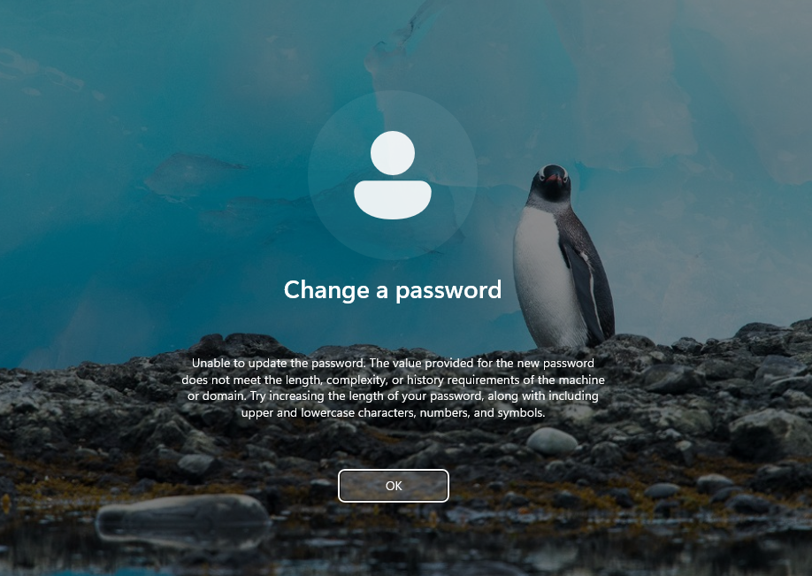
 - Maximum password age: 60 days
 - Account lockout threshold: 5 failed attempts
 - Lockout duration: 15 minutes
   
ii. Endpoint Hardening 
 - Disabled access to Control Panel
  
 - Prevented access to Command Prompt
  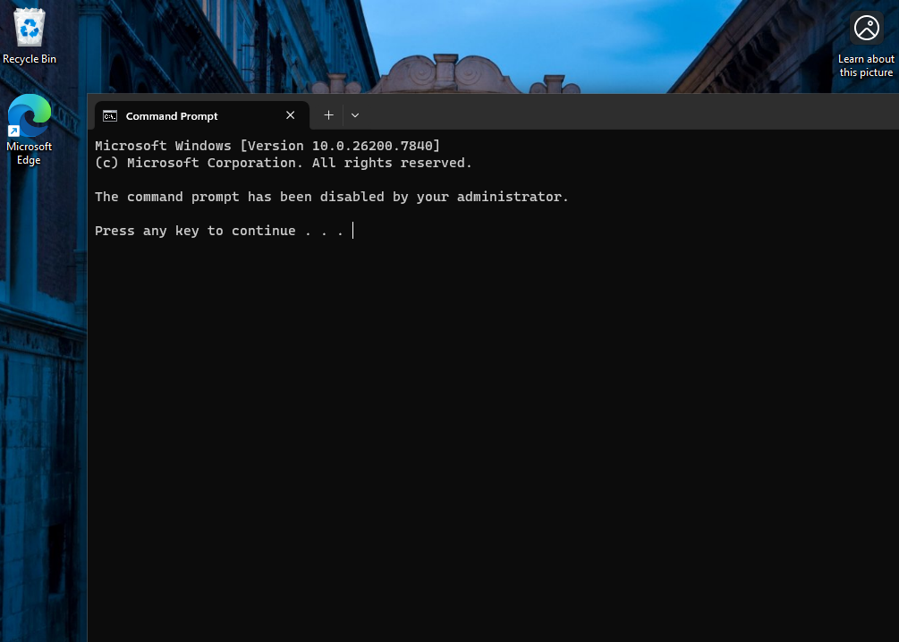
 - Disabled Windows Defender Antivirus turnoff
  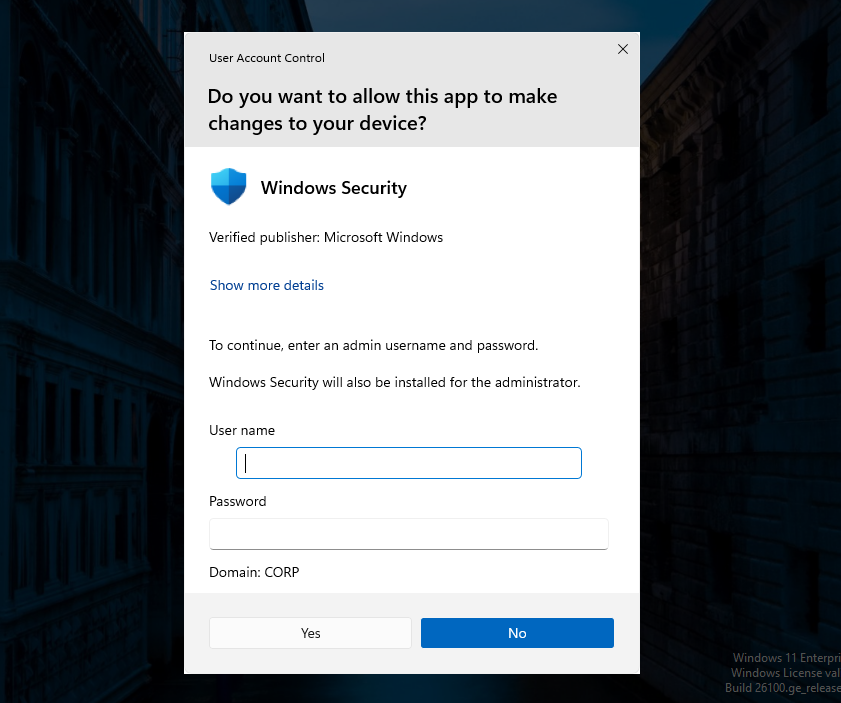
 - Enforced Windows Defender Firewall (Domain Profile enabled, inbound blocked)
   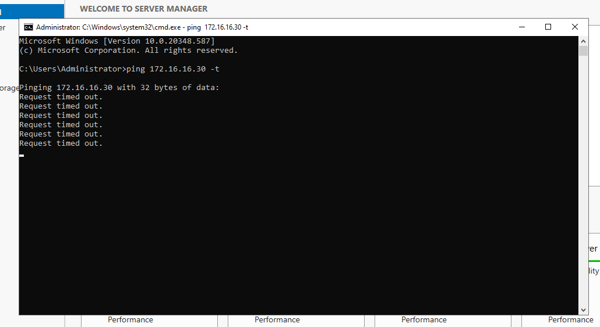
   
🧠 Skills Demonstrated
 - Active Directory deployment
 - DNS configuration and validation
 - Domain join troubleshooting
 - Group Policy creation and linking
 - User Rights Assignment management
 - Enterprise authentication troubleshooting
 - Policy validation using gpresult

**Phase 3 – Identity-Based Internet Access Control (AD + STAS + Sophos Firewall)**
**Objective**
To integrate Active Directory authentication with Sophos Firewall using STAS and enforce identity-based internet access policies with correct NAT configuration.

**Overview**
In this phase, Active Directory authentication was fully integrated with Sophos Firewall using Sophos Transparent Authentication Suite (STAS). The objective was to enforce identity-based internet access policies where only authorized AD users were permitted outbound internet connectivity.

**Architecture Implemented**
- Windows Server 2019 Domain Controller
- Windows 11 Domain-Joined Client
- Sophos Firewall (Port2 as WAN)
- STAS installed on Domain Controller
- Identity-based firewall rule
- Linked NAT rule with MASQ enabled

**Implementation Steps**
1. **Installed Sophos STAS on Domain Controller**
   
   Installed Sophos Transparent Authentication Suite (STAS) on the Domain Controller to enable real-time user authentication tracking between Active Directory and the Sophos Firewall
   STAS monitors Windows Security Log events and maps logged-in users to their IP addresses, allowing identity-based firewall policies.
   
   
   
   **What This Achieved** : Enabled automatic Single Sign-On (SSO) between Windows domain users and Sophos Firewall.
   
3. **Verified AD test connection status = OK**
   
   Configured Active Directory as an authentication server in Sophos Firewall and verified connectivity using the built-in "Test Connection" function.
   
   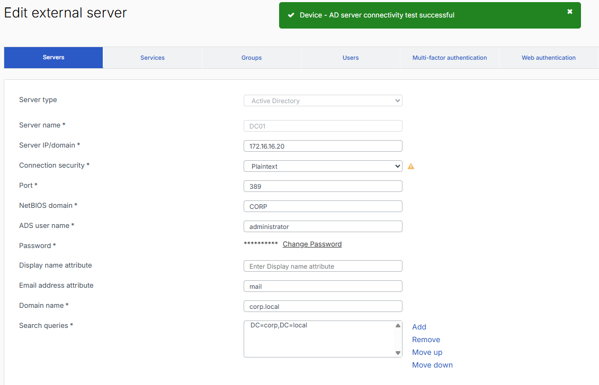
   
   **What This Achieved**
   Confirmed that Sophos Firewall can:
   - Communicate with the Domain Controller
   - Authenticate against AD
   - Query domain users and groups
   
4. **Validated live users detection in Sophos**
   
   Logged into Windows 11 domain client and confirmed the user appeared under Sophos Firewall → Authentication → Live Users.
   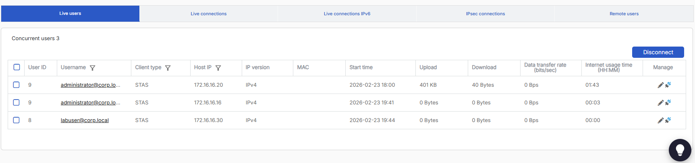
   **What This Achieved** :Proved end-to-end integration:
 
5. **Created AD security groups:**
 
   Created two Active Directory security groups:
   - Internet-Allowed and added Lab User
   - Internet-Blocked and added Test Blocked
   Then assigned domain users to control internet access based on group membership.

   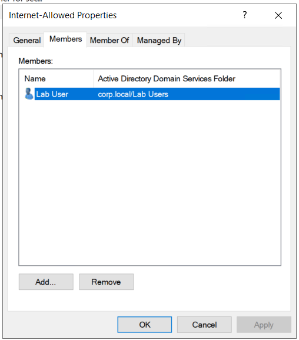
   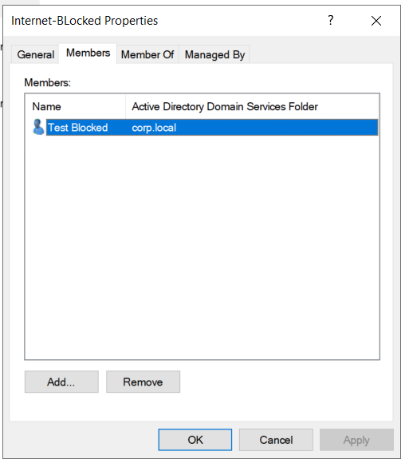

6. **Created identity-based firewall rule allowing only Internet-Allowed group**
 
   After integrating Active Directory with Sophos Firewall, I implemented identity-based access control using AD security groups.
   
   **Rule 1: Allow Internet – Internet-Allowed Group**
   Created a firewall rule that allows internet access only for users who are members of the Internet-Allowed Active Directory security group.
   Configured:
    - Source Zone: LAN
    - Destination Zone: WAN
    - Source Identity: Internet-Allowed (AD Group)
    - Services: HTTP, HTTPS
    - Action: Allow
      
   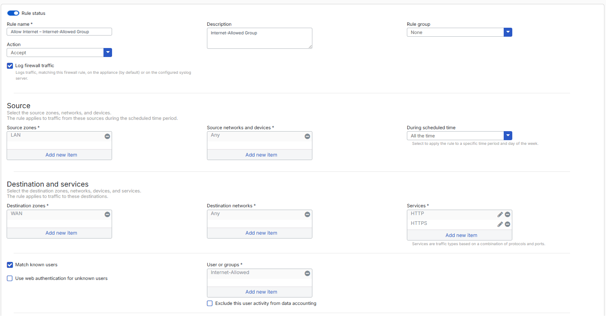
   
    **What This Achieved**
   Implemented role-based internet access control. Only users explicitly placed in the Internet-Allowed group are permitted outbound web access.
   This demonstrates identity-based policy enforcement rather than relying only on IP-based rules.
   
   **Rule 2: Block Internet – Internet-Blocked / Domain Users**
   Created a second firewall rule to explicitly block internet access for users not authorized.
   
   Configured:
    - Source Zone: LAN
    - Destination Zone: WAN
    - Source Identity: Internet-Blocked group (or Domain Users depending on your final configuration)
    - Services: Any
    - Action: Drop
   Positioned this rule appropriately in rule order to ensure it enforces restrictions correctly.

   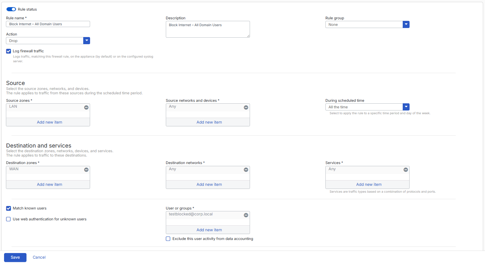

  **What This Achieved**
    - Enforced least privilege access control
    - Prevented unauthorized internet usage
    - Ensured access decisions are based on identity and group membership
  This mirrors how enterprises control internet access for different departments.

6. **Configured NAT & Hardened Network Policy**
   
   Applied NAT (MASQ) on Internet-Allowed Rule: Configured a linked NAT rule to enable outbound internet access for the Internet-Allowed firewall rule.
   
   Configured:
   - Original Source: LAN subnet
   - Translated Source: MASQ (Masquerading)
   - Outbound Interface: WAN (Port2)
    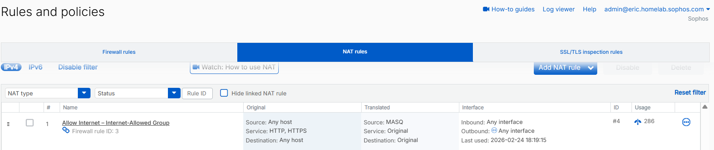

   **What This Achieved**
   - Translates private internal IP addresses to the firewall’s WAN IP
   - Enables controlled internet access
   - Ensures only traffic matching the identity-based rule is NATed
     
  This ensures NAT is tied to controlled firewall rules rather than open policies.

7.**Disabled overly permissive default network policy**

  Disabled the default “Allow LAN to WAN” rule that previously allowed unrestricted outbound internet access.
  If left enabled, the default rule would:
  - Bypass identity-based restrictions
  - Allow all LAN users internet access
  - Defeat the purpose of RBAC enforcement

  By disabling this rule, all traffic must now match the newly created identity-based firewall rules.
  
  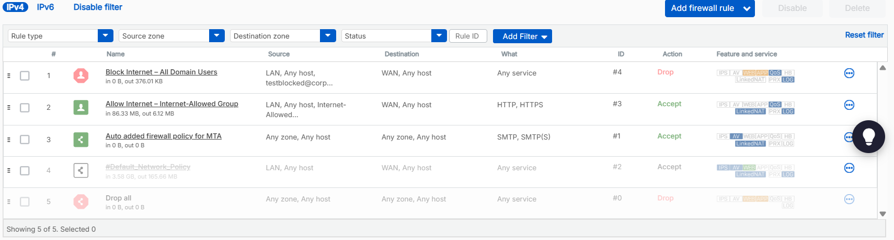
  
  **What This Achieved**
  - Enforced least privilege model
  - Removed open network access
  - Strengthened firewall security posture
  - Ensured policy enforcement integrity
