# 🛡 Enterprise Cybersecurity Home Lab (Hyper-V + Sophos)

## 📌 Project Summary

This project demonstrates the design, deployment, and troubleshooting of a virtual enterprise network security environment using Hyper-V and Sophos Firewall Home Edition.

The objective is to simulate a real-world corporate infrastructure for hands-on cybersecurity practice including network segmentation, firewall configuration, Active Directory integration, and attack detection.

This lab mirrors small-to-mid enterprise network architecture.

**Infrastructure Overview**

**Hypervisor:** Microsoft Hyper-V  
**Firewall:** Sophos Firewall Home Edition  
**Server OS:** Windows Server 2022 (Planned AD Deployment)  
**Network Model:** Segmented WAN / LAN architecture  

**Core Components**

- External Virtual Switch (WAN)
- Internal Virtual Switch (LAN)
- Sophos Firewall (Dual-homed)
- Internal Windows Server
- Future Domain-Joined Client Machines

---
## 📊 Network Diagram

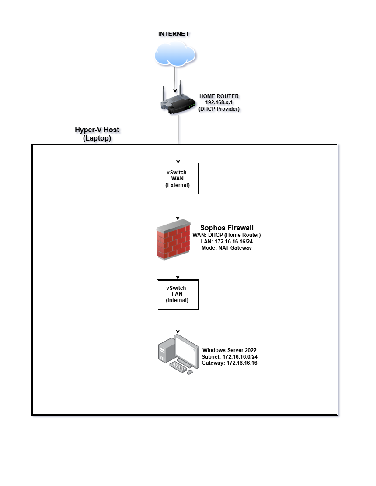

**🔥 Firewall Deployment Details**

**Virtual Machine Configuration**

- Generation 1 (BIOS-based firmware)
- 4GB Static RAM (Dynamic memory disabled)
- 60GB Virtual Disk
- Dual Network Adapters:
  - Adapter 1 → vSwitch-LAN
  - Adapter 2 → vSwitch-WAN

**LAN Configuration**

- LAN IP: 172.16.16.16/24
- DHCP enabled for lab clients
- NAT routing enabled
- Secure Web Admin Access via HTTPS (Port 4444)

**Troubleshooting Performed**

This lab required diagnosing and resolving multiple deployment issues.

**PXE Boot Failure**
Issue:  
“The boot loader did not load an operating system.”

Root Cause:  
UEFI firmware incompatibility with Sophos image.

Resolution:  
Recreated VM using Generation 1 BIOS-based firmware.

---

**firstboot failed: swapon /dev/swap**

Root Cause:  
Dynamic memory instability and insufficient static allocation.

Resolution:  
Disabled Dynamic Memory and allocated fixed 4096MB RAM.

---

**No Web Interface Access**

Root Cause:  
Incorrect WAN/LAN interface mapping in Hyper-V.

Resolution:  
Corrected adapter assignments:
- LAN → Internal Switch
- WAN → External Switch

Successfully restored management access.

---

**Technical Skills Demonstrated**

- Virtualization deployment (Hyper-V)
- Network segmentation (Layer 3 design)
- Dual-homed firewall architecture
- NAT and gateway configuration
- Firewall web management configuration
- DHCP scope configuration
- Secure lab isolation principles

---

**Upcoming Enhancements**

- Deploy Windows Server 2022 Domain Controller
- Configure Active Directory & DNS
- Join Windows Client to domain
- Implement AD-based firewall policies
- Simulate attacker VM for detection testing
- Monitor traffic & security logs

---
**Phase 2 – Active Directory Integration DNS & Group Policy Deployment**

In Phase 2, the lab environment was extended to include:
 - Deployment of Windows Server 2022 (Desktop Experience) as Domain Controller
 - Installation and configuration of:
    i. Active Directory Domain Services (AD DS)
   ii. DNS Server Role
 - Creation of domain: corp.local
 - Creation of domain user: labuser
 - Deployment of Windows 11 client machine
 - Successful domain join and authentication validation
📊 Updated Network Diagram

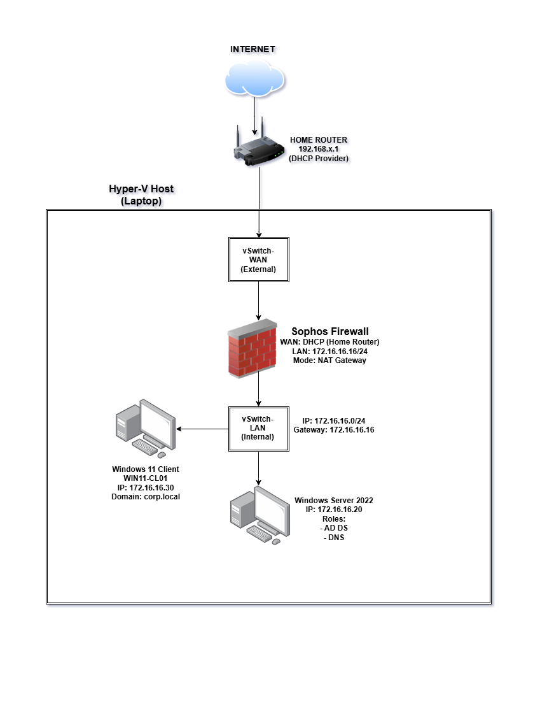

**Group Policy Deployment**

A centralized baseline security policy was created and linked to the domain.
GPO Created: CORP Baseline Security Policy

**Configurations Applied:**
i. Account Lockout Policy
 - 5 failed attempts
 - 15-minute lockout duration
ii. User Restrictions
 - Disabled access to Control Panel
iii. Removable Storage Control
 - Denied access to USB storage devices

Policies were applied via: Computer Configuration → Policies → Security Settings
Validation performed using: gpupdate /force and gpresult /r

**Challenge: Domain User Unable to Log In**

While validating domain authentication on the Windows client machine, the following error occurred:
**“To sign in remotely you need the right to sign in through Remote Desktop Services.”**

**Root Cause**
A misconfiguration in User Rights Assignment within Group Policy modified default logon permissions.
This unintentionally restricted domain user authentication.

Specifically:
- Required security principals were not properly included
- Logon rights precedence in GPO overrode expected behavior
I found out that this is a common enterprise misconfiguration scenario when adjusting RDP or logon security policies.

**Resolution**
 - Reviewed Group Policy → User Rights Assignment
 - Verified membership of required security groups
 - Ensured correct assignment under: Allow log on through Remote Desktop Services
 - Forced policy update: gpupdate /force
 - Successfully validated domain login post-restart
   
**Advanced Group Policy Hardening**
Additional hardening controls were implemented

i. Password Policy Hardening
Configured via: Computer Configuration → Policies → Windows Settings → Security Settings → Account Policies
Changes applied:
 - Minimum password length: 12 characters
 - Complexity requirements: Enabled
   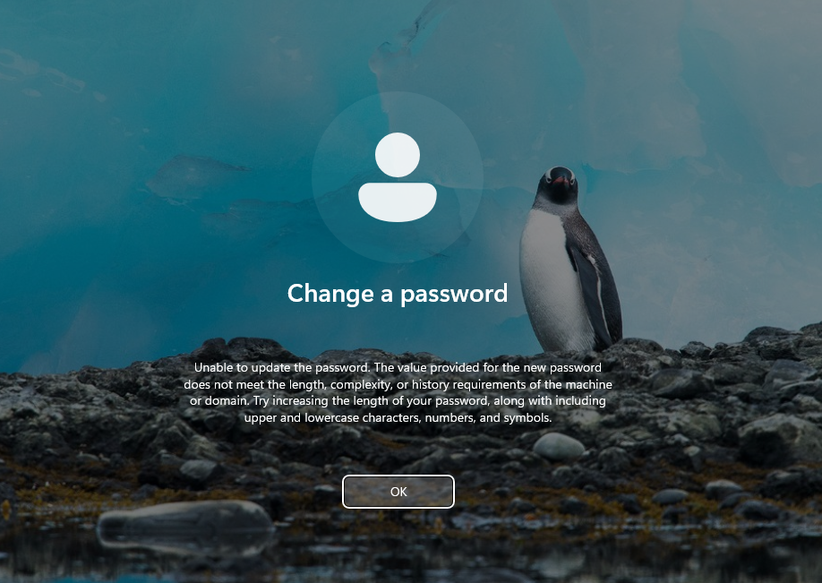
 - Maximum password age: 60 days
 - Account lockout threshold: 5 failed attempts
 - Lockout duration: 15 minutes
   
ii. Endpoint Hardening 
 - Disabled access to Control Panel
  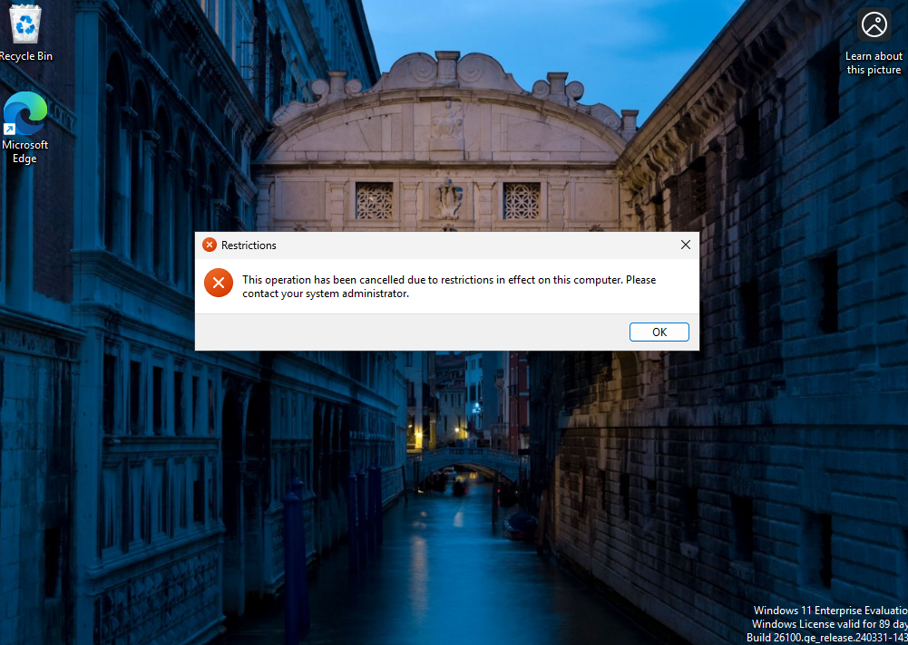
 - Prevented access to Command Prompt
  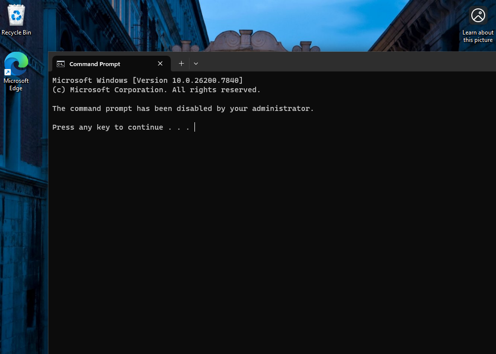
 - Disabled Windows Defender Antivirus turnoff
  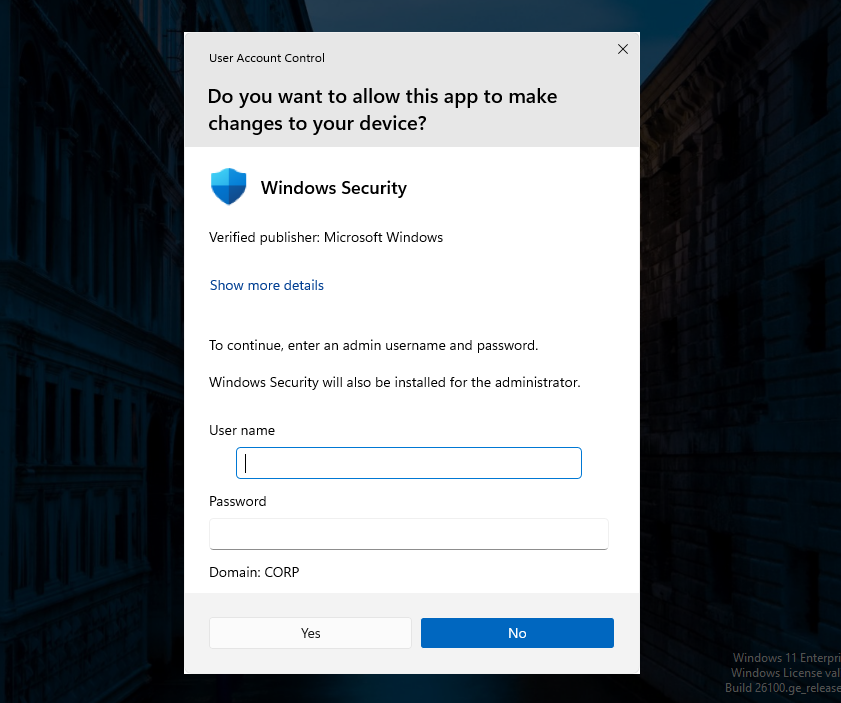
 - Enforced Windows Defender Firewall (Domain Profile enabled, inbound blocked)
   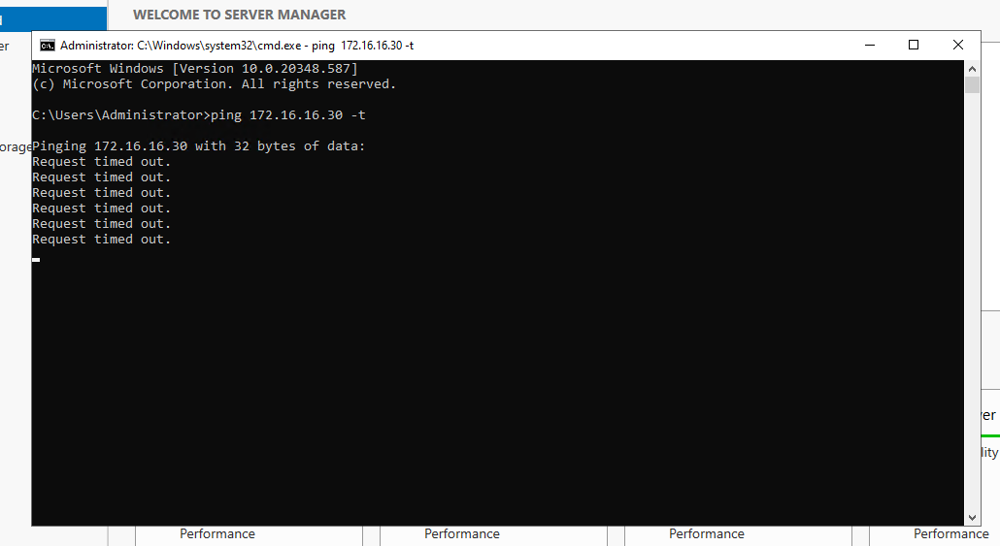
   
🧠 Skills Demonstrated
 - Active Directory deployment
 - DNS configuration and validation
 - Domain join troubleshooting
 - Group Policy creation and linking
 - User Rights Assignment management
 - Enterprise authentication troubleshooting
 - Policy validation using gpresult

**Phase 3 – Identity-Based Internet Access Control (AD + STAS + Sophos Firewall)**

**Objective**

To integrate Active Directory authentication with Sophos Firewall using STAS and enforce identity-based internet access policies with correct NAT configuration.

**Overview**

In this phase, Active Directory authentication was fully integrated with Sophos Firewall using Sophos Transparent Authentication Suite (STAS). The objective was to enforce identity-based internet access policies where only authorized AD users were permitted outbound internet connectivity.

**Architecture Implemented**
- Windows Server 2019 Domain Controller
- Windows 11 Domain-Joined Client
- Sophos Firewall (Port2 as WAN)
- STAS installed on Domain Controller
- Identity-based firewall rule
- Linked NAT rule with MASQ enabled

**Implementation Steps**
1. **Installed Sophos STAS on Domain Controller**
   
   Installed Sophos Transparent Authentication Suite (STAS) on the Domain Controller to enable real-time user authentication tracking between Active Directory and the Sophos Firewall
   STAS monitors Windows Security Log events and maps logged-in users to their IP addresses, allowing identity-based firewall policies.
   
   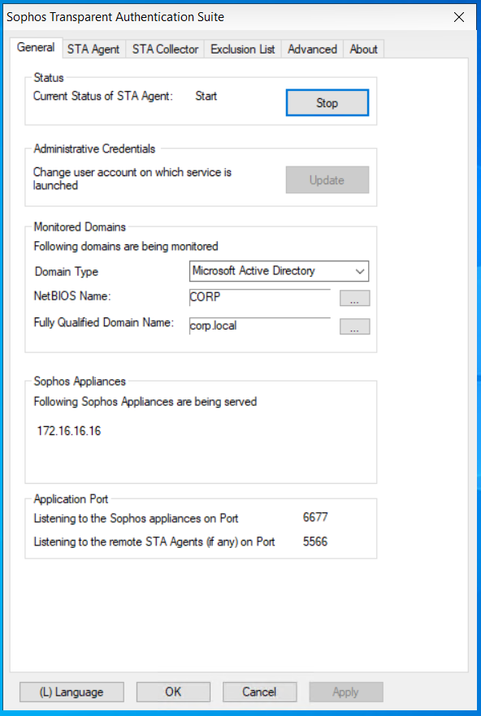
   
   **What This Achieved** : Enabled automatic Single Sign-On (SSO) between Windows domain users and Sophos Firewall.
   
3. **Verified AD test connection status = OK**
   
   Configured Active Directory as an authentication server in Sophos Firewall and verified connectivity using the built-in "Test Connection" function.
   
   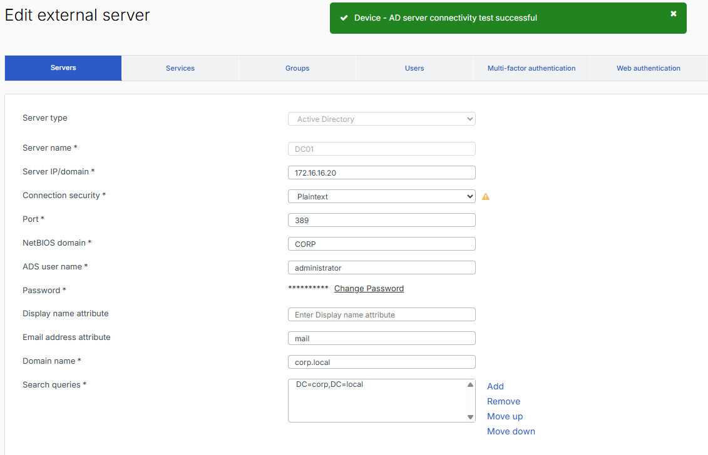
   
   **What This Achieved**
   Confirmed that Sophos Firewall can:
   - Communicate with the Domain Controller
   - Authenticate against AD
   - Query domain users and groups
   
4. **Validated live users detection in Sophos**
   
   Logged into Windows 11 domain client and confirmed the user appeared under Sophos Firewall → Authentication → Live Users.
   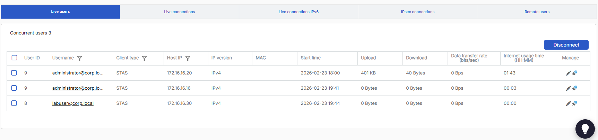
   **What This Achieved** :Proved end-to-end integration:
 
5. **Created AD security groups:**
 
   Created two Active Directory security groups:
   - Internet-Allowed and added Lab User
   - Internet-Blocked and added Test Blocked
   Then assigned domain users to control internet access based on group membership.

   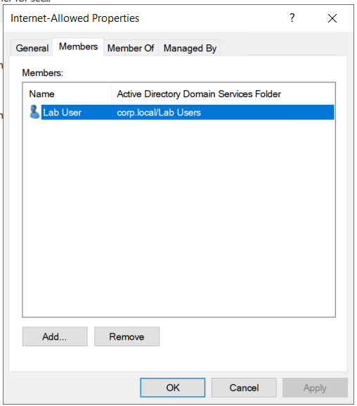
   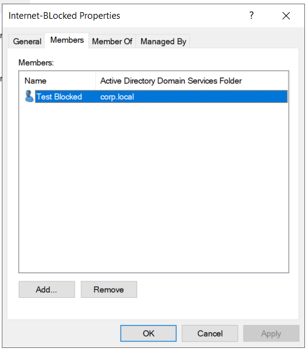

6. **Created identity-based firewall rule allowing only Internet-Allowed group**
 
   After integrating Active Directory with Sophos Firewall, I implemented identity-based access control using AD security groups.
   
   **Rule 1: Allow Internet – Internet-Allowed Group**
   Created a firewall rule that allows internet access only for users who are members of the Internet-Allowed Active Directory security group.
   Configured:
    - Source Zone: LAN
    - Destination Zone: WAN
    - Source Identity: Internet-Allowed (AD Group)
    - Services: HTTP, HTTPS
    - Action: Allow
      
   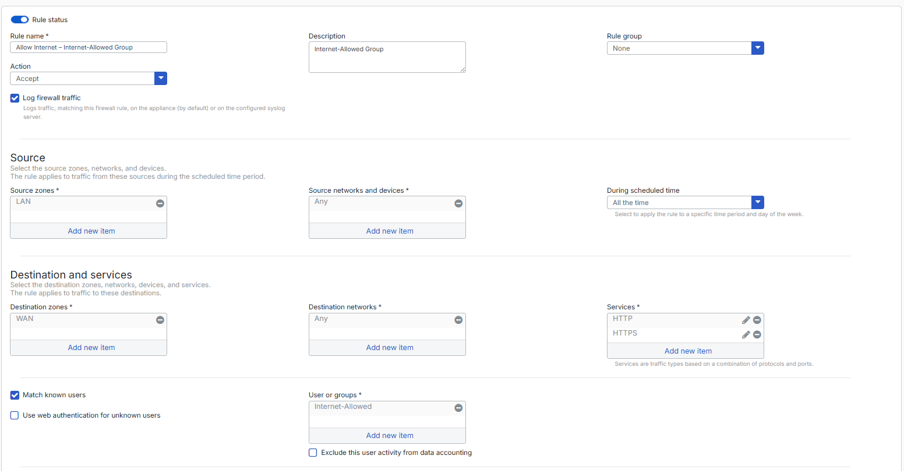
   
    **What This Achieved**
   Implemented role-based internet access control. Only users explicitly placed in the Internet-Allowed group are permitted outbound web access.
   This demonstrates identity-based policy enforcement rather than relying only on IP-based rules.
   
   **Rule 2: Block Internet – Internet-Blocked / Domain Users**
   Created a second firewall rule to explicitly block internet access for users not authorized.
   
   Configured:
    - Source Zone: LAN
    - Destination Zone: WAN
    - Source Identity: Internet-Blocked group (or Domain Users depending on your final configuration)
    - Services: Any
    - Action: Drop
   Positioned this rule appropriately in rule order to ensure it enforces restrictions correctly.

   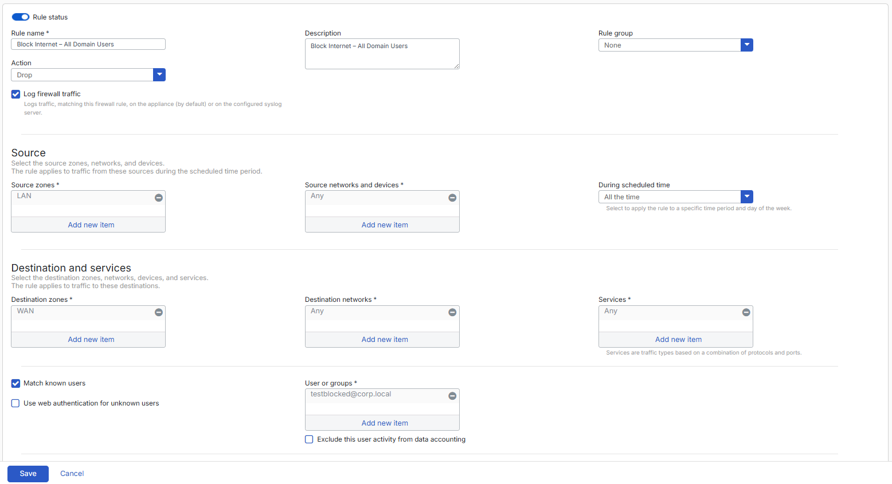

  **What This Achieved**
    - Enforced least privilege access control
    - Prevented unauthorized internet usage
    - Ensured access decisions are based on identity and group membership
  This mirrors how enterprises control internet access for different departments.

6. **Configured NAT & Hardened Network Policy**
   
   Applied NAT (MASQ) on Internet-Allowed Rule: Configured a linked NAT rule to enable outbound internet access for the Internet-Allowed firewall rule.
   
   Configured:
   - Original Source: LAN subnet
   - Translated Source: MASQ (Masquerading)
   - Outbound Interface: WAN (Port2)
    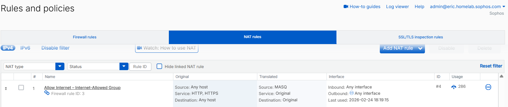

   **What This Achieved**
   - Translates private internal IP addresses to the firewall’s WAN IP
   - Enables controlled internet access
   - Ensures only traffic matching the identity-based rule is NATed
     
  This ensures NAT is tied to controlled firewall rules rather than open policies.

7. **Disabled overly permissive default network policy**

  Disabled the default “Allow LAN to WAN” rule that previously allowed unrestricted outbound internet access.
  If left enabled, the default rule would:
  - Bypass identity-based restrictions
  - Allow all LAN users internet access
  - Defeat the purpose of RBAC enforcement

  By disabling this rule, all traffic must now match the newly created identity-based firewall rules.
  
  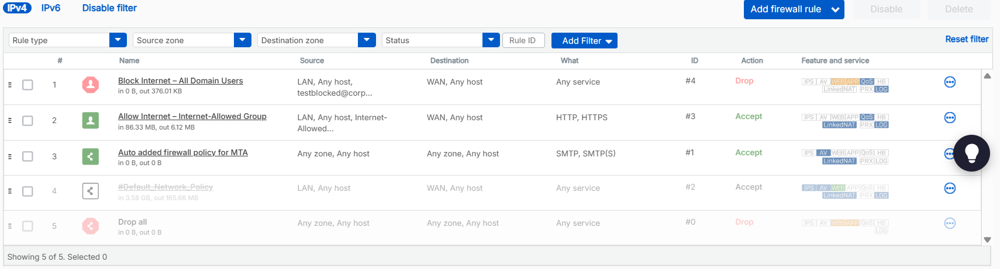
  
  **What This Achieved**
  - Enforced least privilege model
  - Removed open network access
  - Strengthened firewall security posture
  - Ensured policy enforcement integrity

8. **Validated Identity-Based Access Enforcement (Allow vs Block Test)**

   After configuring identity-based firewall rules, I performed validation testing using two separate domain users:
   - labuser → Member of Internet-Allowed group
   - testblocked → Member of Internet-Blocked group (or not added to Internet-Allowed)

I logged into the Windows 11 domain client using each account and tested outbound internet connectivity to confirm policy enforcement.

**Test 1 – labuser (Internet-Allowed Group)**

Expected Behavior: User should have full internet access based on identity-based firewall rule.

Result:
- Successfully accessed allowed websites
- Traffic matched the “Allow Internet – Internet-Allowed Group” rule
- User visible under Sophos Live Users

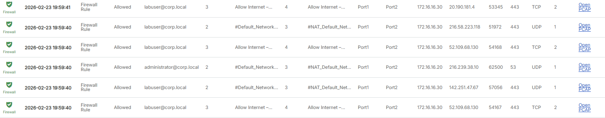

**What This Proves**
- STAS identity mapping works
- Firewall correctly matches AD group membership
- NAT is functioning correctly
- Identity-based access control is enforced

**Test 2 – testblocked (Internet-Blocked Group)**

Expected Behavior: User should be denied internet access due to identity-based block rule.

Result:
- Web access failed
- Traffic matched the “Block Internet” rule
- Sophos logs show dropped traffic

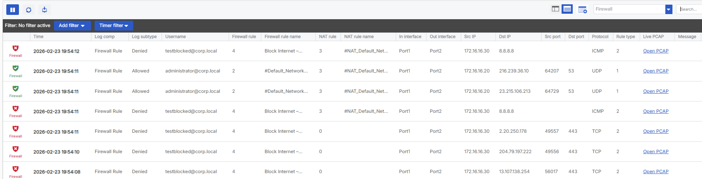

**What This Proves**
- RBAC enforcement works correctly
- Firewall rule order is properly configured
- Default LAN rule is no longer bypassing restrictions
- Identity-based security model is functioning as designed

**Architecture Overview**

This lab environment simulates an enterprise identity-aware network security architecture integrating Microsoft Active Directory with Sophos Firewall for centralized authentication and policy enforcement.
The Domain Controller provides authentication services, DNS resolution, and centralized identity management. Sophos Transparent Authentication Suite (STAS) monitors domain logon events (Event ID 4624) and maps authenticated users to their IP addresses in real time.
This integration enables identity-based firewall rule enforcement, allowing network access decisions to be made based on Active Directory group membership rather than static IP addresses.

Outbound internet access is controlled through:
- Role-Based Access Control (RBAC) via AD security groups
- Identity-aware firewall rules
- Linked NAT (MASQ) configuration
- Removal of default permissive policies

This architecture reflects real-world enterprise implementations where security enforcement is identity-driven rather than network-based.

**PHASE 5 – Identity-Based Web Filtering & HTTPS Inspection**

**Objective**

To implement identity-based web filtering integrated with Active Directory authentication, allowing granular control over internet access based on user group membership while enforcing HTTPS inspection for encrypted traffic visibility.

**Overview**

After successfully integrating Active Directory with Sophos Firewall using STAS (Phase 3), this phase focused on enforcing corporate internet usage policies through:

  - Category-based web filtering
  - Identity-based policy enforcement
  - HTTPS traffic inspection
  - Real-time log validation

The goal was to ensure only authorized users had internet access while blocking inappropriate content categories.

**Architecture Overview**

The implementation follows this traffic flow:

Windows 11 Client → Domain Controller (Authentication via STAS) → Sophos Firewall (Identity Mapping + Web Filtering + HTTPS Inspection) → Internet (WAN via NAT)

**Key Components:**

  - Domain Controller (Active Directory Authentication)
  - Sophos STAS (User Logon Monitoring)
  - Sophos Firewall (Policy Enforcement)
  - Identity-Based Firewall Rule
  - Web Filtering Policy
  - SSL/TLS Decryption Engine
  - MASQ NAT on WAN Interface

This design ensures that internet access is not IP-based but tied directly to authenticated AD users.

**Implementation Steps**

1. **Created Corporate Web Filtering Policy**

A custom web policy named Corporate Web Policy was created.

Configured settings:
  - Social Networking → Block
  - Sexually Explicit → Block
  - Default action configured appropriately
  - HTTPS Decryption enabled within the policy

This policy enforces acceptable use standards aligned with corporate environments.

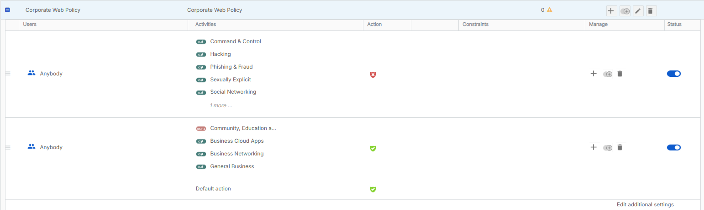.

2. **Applied Web Policy to Identity-Based Firewall Rule**

The Corporate Web Policy was attached to the existing:

Identity-Based Internet Firewall Rule

This rule:
  - Source: Internet-Allowed AD Group
  - Destination: WAN
  - Services: HTTP and HTTPS
  - NAT: MASQ applied on WAN
  - Web Policy: Corporate Web Policy

This ensured filtering was enforced only for authenticated AD users.

3. **Enabled HTTPS Decryption & Scanning**

Since modern websites use HTTPS encryption, HTTPS Decryption was enabled under Web settings to allow:
  - Deep inspection of encrypted traffic
  - Accurate URL categorization
  - Enforcement of category-based blocking
    
Without HTTPS inspection, encrypted traffic would bypass filtering logic.

4. **Exported and Installed Sophos SSL CA Certificate**

To prevent browser certificate errors:
  - The Sophos default SSL CA certificate was exported from the firewall.
  - Installed on the Windows 11 client under: Trusted Root Certification Authorities (Computer Account)

This allowed the client to trust the firewall during HTTPS decryption.

5. **Validated Category-Based Blocking**

Testing was performed using multiple websites:
  - x.com (Social Networking) → Successfully Blocked
  - xxx.com (Sexually Explicit) → Successfully Blocked
  - Facebook → Successfully Blocked

Log Viewer confirmed:
  - Identity-based logging
  - Category detection
  - Web filtering enforcement

This validated that HTTPS inspection and category-based blocking were operational.

6. **Challenge Faced & Resolution**
   **Facebook Not Consistently Blocked**
Although Social Networking category was configured as Block, Facebook traffic did not consistently appear in Web Filter logs while other social media sites (x.com) were correctly blocked.

**Troubleshooting Performed**
  - Verified STAS authentication status
  - Confirmed firewall rule priority
  - Validated Web Policy assignment
  - Checked SSL decryption settings
  - Installed and verified Sophos CA certificate
  - Reviewed category classification
  - Cleared sessions and retested

  **Technical Analysis** : The behavior was linked to modern CDN-based traffic patterns and encrypted traffic handling mechanisms used by certain platforms. While the filtering engine was functional (validated by blocking other social networking and explicit sites), certain high-traffic platforms may require additional tuning depending on deployment mode (Web Proxy vs Policy-Based Inspection).

**Key Skills acquired**
  - Identity-Based Access Control
  - Active Directory Integration
  - Web Proxy Configuration
  - HTTPS Traffic Decryption
  - SSL Certificate Deployment
  - Log Analysis & Monitoring
  - Enterprise Troubleshooting Methodology
  - NAT Integration with Filtering Policies
